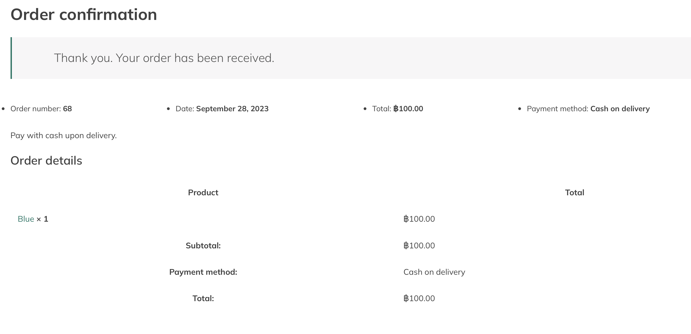

# Modern-Ecommerce-Platforms
Design and Develop Modern Ecommerce Plafform  
Ameer Hateemo

## *Abstract*
This project, Takumi09, focuses on the development of an E-Commerce website for Smart T-shirts. Leveraging WordPress and WooCommerce, the platform aims to provide a seamless and secure shopping experience for smart T-shirt enthusiasts. This document provides an overview of the project, methodology, software requirements, and a visual representation. It also includes a Business Process Model and Notation (BPMN) representation, elucidating the intricate processes that underpin the website's functionality. The Takumi09 project aims to create a user-centric online store for smart T-shirts, bridging the gap between traditional and digital shopping experiences.

## *Introduction*
"In a world where shopping is going digital, Takumi09 is stepping into the online realm. This project is dedicated to the launch of Takumi09's Smart T-shirts E-Commerce Website, where we're bringing the sophistication and innovation of our physical store to the online platform.

Our E-Commerce Website, powered by WordPress and WooCommerce, is set to redefine smart T-shirt shopping. This introduction offers a glimpse of our vision and how we intend to seamlessly blend the online and smart apparel worlds.

In the subsequent sections, we will explore the project's methodologies, technologies, and strategic approaches, all aimed at creating an immersive and user-friendly online destination for smart T-shirt enthusiasts. With this project, Takumi09 reiterates its commitment to bridging the gap between traditional fashion and cutting-edge technology in the digital age."

## 2. Software and Tools Used
**2.1 Mamp Pro:** [Mamp Pro](https://www.mamp.info/en/mamp-pro/mac/) is quickly sets up a free local server environment on your macOS or Windows computer. It won't interfere with your existing Apache installation. You can install Apache, Nginx, PHP, and MySQL without scripting or configuration changes. If you no longer need MAMP, simply delete its folder to return to the original state. Plus, you can test projects on mobile devices with our local DNS server, NAMO.

**2.2 WordPress:** [WordPress](https://th.wordpress.org/) serves as the primary content management system (CMS) for our website, offering a flexible and user-friendly environment for managing web content.

**2.3 WooCommerce:** [WooCommerce](https://woocommerce.com/) is integrated seamlessly with WordPress, empowering our website with e-commerce capabilities, including product management, shopping cart functionality, and secure payment processing.

**2.4 PDF Invoices & Packing Slips for WooCommerce:** [PDF Invoices & Packing Slips for WooCommerce](https://wordpress.org/plugins/woocommerce-pdf-invoices-packing-slips/) is responsible for generating professional invoices and packing slips for customer orders, ensuring a smooth and professional shopping experience.

**2.6 Chaty:** [Chaty](https://wordpress.org/plugins/chaty/") is a Floating Chat Widget plugin that user can click on link to get more contact with the website.

## 3. Visual Overview
Explore Takumi09 E-Commerce Website through visual representations. This section includes a BPMN diagram outlining key processes and step-by-step screenshots of my website to provide a visual insight into the user experience and functionality.

### 4.1 Website overview
**HomePage**

**Shoppage**

**Cart**

### 4.2 BPMN Diagram

This BPMN diagram show my E-Commerce Website processes, showcasing key interactions and workflows that enhance the platform's user-friendly online bookstore experience.

#### All Pools BPMN
- ###Customer

- **Start Event** : Marks the beginning of the customer's visit on the platform.
- **Select Products** : The customer selects the desired products from the available options on shop menu.

- **Shop page** :The costumer can select the product from this page.
- **View my cart** : When the customer finished select the product and customer can see their select products at view my cart.

  - **Checkout Process** :The process to Checkout the product. 
  - **Fill the shipping detail** : The customer fill their shipping detail.
  
- **Identify payment method** : customer choose the payment method. In my wetsite have 2 ways are Transferring , and Delivering.
 
- **Review order process** : In this process, customer can check that the order is success or not. If not success, the order will cancel. If order is success, customer just wait for order to shipping. 
 
- **Recieve the  product process** : Recieve the product from shipping company.
- **End Event (Red Circle)**
- ####Admin

- **Add product** :This task represents the process of adding a new product to your e-commerce store's catalog. It includes entering product details, assigning categories, and setting pricing.

  

- **Publish Product:** :This task involves making the approved product visible to customers on the website. It ensures that the product is included in relevant search results and categories.
  - **Update Product Information:** This task allows admins to modify existing product details, such as descriptions, prices, or images. It's used for maintaining accurate product information.
  - **Remove Product**: When a product is discontinued or permanently out of stock, this task is used to remove the product from the website. It ensures customers can no longer purchase the item.

    

  - **Inventory Management** :This task involves monitoring and managing product inventory levels. Admins may use this task to adjust stock levels, track product availability, and reorder items when necessary.
   
    

  - **Check order** : Admin will check the order list to see if there are any new orders or not. If there is a new order, the admin will go to the next task.

    

  - **Check slip and confirm order process**: This process admin will check the slip of payment and confirm order.

    

  - **Correct gataway** : when admin check correctness about payment. If correct, It will go to Check Stock process. If not correct, It will cancel the order.
  - **Check Stock process** : admin will check stock. If have product enough, It will go to next process (Prepare order for shipping process). If out of stock, the order will cancel.
  - **Prepare order for shipping process** : this task is to prepare product for shipping or pack items properly for delivery.
  - **Ship order to shipping company process** :This process is about sent product to shipping company.
- web system

- Banking system
- 
  
- Delivery system

